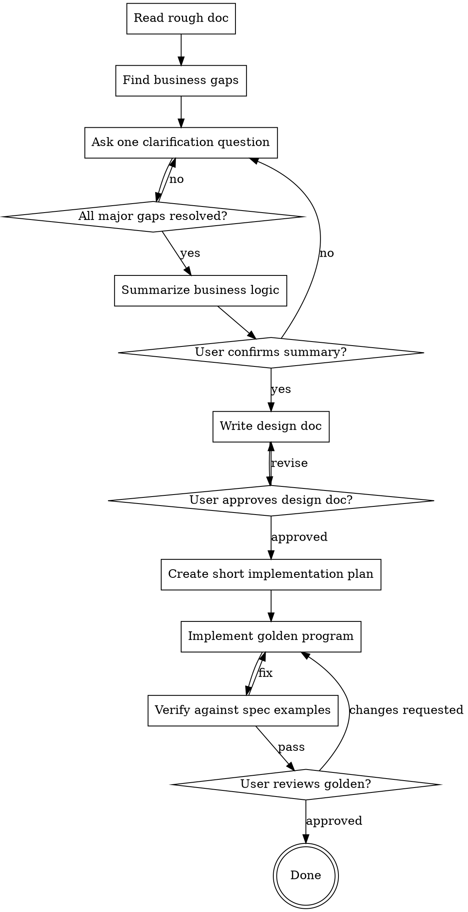

# Turn Requirement Docs Into Specs and Golden Programs

Read a requirements or design document, resolve any ambiguities that matter for correctness, write an approved detailed design doc, and produce a readable golden reference implementation.

Follow three stages in order:

1. Clarify
2. Write spec
3. Build golden program

<HARD-GATE>
Do not write code, tests, scaffolding, or implementation plans until the business logic has been clarified and the written design doc has been approved by the user.

During clarification, ask about business meaning, decision rules, input/output semantics, examples, and edge cases. Do not drift into engineering choices unless the user explicitly asks for them or the business answer depends on them.
</HARD-GATE>

## Checklist

Complete these items in order:

1. Read the source document and any immediately relevant local context
2. Identify missing or ambiguous business rules
3. Ask clarifying questions one at a time
4. Summarize the resolved business logic and get confirmation
5. Write the detailed design doc
6. Ask the user to review the design doc
7. Decompose the golden program into a short implementation plan
8. Implement the golden program in small verified steps
9. Ask the user to review the golden program

## Process Flow



## Scope Control

Assess scope before diving into details.

If the rough document actually describes several loosely related subsystems, stop and decompose it into smaller slices first. Clarify and specify one slice at a time. Do not try to produce a single giant spec for an entire platform in one pass.

## Clarification Stage

Read critically. Assume the document is directionally useful but incomplete.

Prioritize gaps in this order:

### 1. Goal and domain meaning

- What business outcome is the feature supposed to produce
- What each important input means in domain terms
- What each output means in domain terms
- What makes an output correct

### 2. Rules and transformations

- How inputs map to outputs
- Which rules are mandatory versus optional
- Which rule wins when rules conflict
- Whether ordering, grouping, or aggregation matters

### 3. Boundaries and examples

- Empty input behavior
- Missing or partial fields
- Invalid values
- Duplicates
- Min/max values
- Rounding or precision rules
- Concrete input to output examples

### 4. Operating assumptions

- Whether time, state, or history matters
- Whether the logic depends on prior records or external context
- Whether there are practical volume or latency constraints that change behavior

## Questioning Rules

- Ask one question at a time
- Prefer multiple choice when likely options are visible
- Explain why the question matters for correctness
- Restate each answer precisely before moving on
- Keep a mental queue of resolved versus unresolved gaps

Use this shape when asking:

> The document says "[quoted or paraphrased point]". I need to clarify: [business question].
>
> This matters because [correctness impact].
>
> Options, if helpful:
> A. ...
> B. ...
> C. ...

After the user answers, confirm with:

> To confirm: [precise restatement]. Is that right?

## Design Doc Stage

After the user confirms the clarified business logic, write a detailed design doc. Keep it implementation-ready but still centered on externally visible behavior and decision rules.

Use this structure:

```markdown
# [Feature Name] Design

## 1. Objective
Define the business outcome and success criteria.

## 2. Domain Model
Define the important entities, fields, and their business meaning.

## 3. Input Contract
Describe accepted inputs, required fields, optional fields, ranges, units, and assumptions.

## 4. Output Contract
Describe outputs, structure, semantics, ordering, and interpretation.

## 5. Decision Rules
List the business rules in precedence order.

## 6. Processing Flow
Describe the end-to-end transformation step by step in precise terms.

## 7. Edge Cases
Define empty, invalid, duplicate, extreme, and partial-input behavior.

## 8. Examples
Provide representative input to output examples, including normal and edge cases.

## 9. Acceptance Criteria
Define what a correct implementation must do.
```

Keep the written design concrete enough that two competent engineers would produce the same output behavior from it.

After writing the doc, ask the user to review it before continuing.

## Golden Program Stage

After the user approves the design doc, create a short implementation plan for the golden program and then execute it.

Keep the plan lightweight:

- Identify the public entrypoint
- Break the logic into a few small modules or steps
- Map each module or step back to the design doc sections
- Decide how to verify behavior using the examples and acceptance criteria in the spec

Then implement the golden program with these rules:

- Optimize for correctness and readability, not polish or performance
- Keep the implementation self-contained unless the repo already establishes a pattern to follow
- Add brief comments only where they help link logic back to the design
- Verify behavior against the design doc examples before declaring success
- Surface any remaining ambiguity instead of guessing silently

The golden program is a reference implementation. It should make the intended business behavior easy for a reviewer to inspect.

## Output Expectations

When this skill is used well, it should produce:

1. A clarified and user-confirmed business understanding
2. A detailed written design doc
3. A readable golden reference program that matches that design

Do not skip user confirmation gates between these stages.
