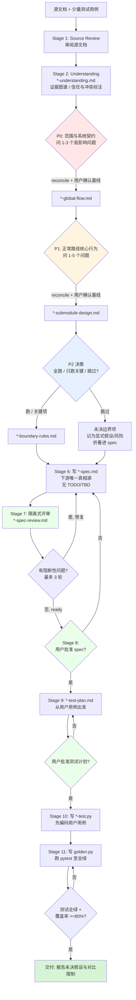

# business-spec-to-golden 工作流总结

> 用途：把**不可靠/不完整的业务设计文档 + 少量测试用例**，转化为**澄清并经过评审的实现规格（spec）、可执行测试、以及通过测试验证的标准实现（golden program）**。

## 一句话定位

核心难点不只是"生成代码"，而是：**不被低质量源文档误导、用更少但更高价值的问题做澄清、把不确定的需求收敛成可直接实现的规格**，最后用 TDD 方式产出 `golden.py`。

## 六条核心原则

| 原则 | 含义 |
|------|------|
| **证据优先 (Evidence first)** | 源文档只是证据不是真理；区分源文档事实 / 用户测试事实 / 用户确认 / 推断 / 假设 / 矛盾 |
| **Golden 影响优先** | 只问能改变输出、断言、输入契约、对外行为或拒绝/默认行为的问题 |
| **分层收敛 (P0/P1/P2)** | 逐层生成问题；上层答案可让下层候选问题失效、合并或重写 |
| **P2 可选** | P2 是开发者可控的风险补充层，可全跑/只跑关键项/跳过 |
| **低打扰** | 不逐条提问，按批次提出少量高影响问题并附推荐假设 |
| **规格独立可用** | `*-spec.md` 是下游唯一真相源，仅凭它就能设计测试与实现 golden |

外加 **TDD 闸门**：规格未评审、测试计划未批准、可执行测试未就绪之前，**不准动 `golden.py`**。

## 11 个阶段（Stage Order）

1. **Source Review** — 审阅源文档与测试用例
2. **Understanding** — 写 `*-understanding.md`（可纠错的工作模型，含证据图谱、信任/冲突标注）
3. **P0 问题预算与基线** — 范围与系统契约 → 产出 `*-global-flow.md`
4. **P1 问题预算与基线** — 正常路径核心行为 → 产出 `*-submodule-design.md`
5. **P2 决策** — 全跑 / 只跑关键 / 跳过 → 跑则产出 `*-boundary-rules.md`
6. **Spec** — 写 `*-spec.md`（重述所有 golden 相关规则，无 TODO/TBD）
7. **隔离式 Spec 评审** — 写 `*-spec-review.md`，阻断性问题为硬闸门（最多 3 轮）
8. **用户批准 Spec** — 评审通过且用户确认后才能往下
9. **Test Plan** — 写 `*-test-plan.md`（从用户用例出发，映射规则到测试），需用户批准
10. **Executable Tests** — 写 `*-test.py`（先编码用户用例，再补 P0/P1 高价值覆盖）
11. **Golden Program** — 写 `golden.py`，跑测试至全绿，跑覆盖率（默认 ≥80%，纯逻辑建议 ≥90%）

> 若后续答案改动了已批准的上游契约，先把下游产物标记为 `stale` 再继续。

## P0 / P1 / P2 语义（按"实现影响"分类，而非按主题）

- **P0 — Golden 范围与系统契约**：处理切片、系统级输入/输出、golden 要证明什么、权威测试用例、不可靠源章节、主要处理阶段/模块边界。
- **P1 — 核心正常路径行为**：字段提取与映射、计算/转换/归一/过滤/聚合/排序/排名/开窗、规则优先级、输出构造。
- **P2 — 边界/冲突/默认行为**：缺失或空输入、非法/越界值、重复/延迟/冲突记录、默认填充、拒绝/报错行为、未解决的源/测试矛盾。

**问题预算**：每层建候选池 → 按 golden 影响排序（`critical`/`important`/`deferred`）→ 只问最小有用批次（P0 约 1–3，P1 约 1–5，P2 仅在开发者选入后问关键项）→ 每个答案后先对整层做 reconcile（标记 canonical 决策、`resolved-by`、`obsolete`、合并重复、降级为假设）。

## 默认产物清单（按顺序）

```
1. *-understanding.md
2. *-p0-questions.md / *-p1-questions.md / *-p2-questions.md
3. *-global-flow.md / *-submodule-design.md / (可选) *-boundary-rules.md
4. *-spec.md
5. *-spec-review.md
6. *-test-plan.md
7. *-test.py
8. golden.py
```

默认路径：`docs/business-specs/YYYY-MM-DD-<topic>-*`
默认实现剖面：Python golden + `pytest`，纯函数入口，确定性、自包含（不用网络/时钟/随机/环境依赖）。

## 流程图



> 图例：🟥 P0 / 🟧 P1 / 🟦 P2 为分层澄清；🟩 节点为人工/评审闸门（spec 评审、用户批准 spec、批准测试计划）。

## 关键闸门小结（汇报要点）

1. **澄清是分层、有预算、低打扰的**，不是一次性问题轰炸。
2. **规格先于代码**：spec 写完要经过独立评审 + 用户批准，才进测试。
3. **TDD 硬约束**：测试先于 `golden.py`；代码若先写则停下补测试。
4. **可追溯**：每条 golden 规则都标注来源与信任级别，假设全部显式化、无隐藏假设。
5. **可演进**：上游契约变更会把下游产物标 `stale`，回退重做对应层。
